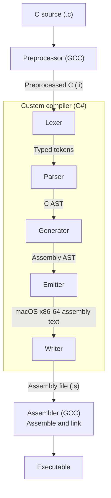

# C Compiler

> [!WARNING]
> This project is under development. Additional compiler stages and language
> features will be added as the implementation progresses through the book.

This project is a C# and .NET 11 RC1 implementation of the C compiler described in [*Writing a C Compiler*](https://nostarch.com/writing-c-compiler) by Nora Sandler.

The implementation follows the book's progression from parsing C source through semantic analysis and code generation, with the goal of making each compiler stage clear, testable, and easy to extend.

## Requirements

- .NET 11 RC1 SDK **11.0.100-rc.1.26425.128**, as specified in `global.json`
- GCC available on `PATH` (Apple's Clang-backed `gcc` is suitable)
- For the custom compiler: macOS with x86-64 assembly/linking support. Running
  its executables on Apple Silicon requires Rosetta 2.

Install the SDK from the [official .NET 11 download page](https://dotnet.microsoft.com/en-us/download/dotnet/11.0),
selecting the RC1 SDK version above: Arm64 for Apple Silicon or x64 for Intel
Macs. The repository uses preview C# features and limited SDK roll-forward;
installing only a newer SDK may not satisfy `global.json`.

Install Apple's Command Line Tools if you do not already have them:

```sh
xcode-select --install
```

On Apple Silicon, install Rosetta 2 if needed to execute the custom compiler's
x86-64 output:

```sh
softwareupdate --install-rosetta
```

Check the prerequisites before building:

```sh
dotnet --version
gcc --version
xcode-select -p
```

Run `dotnet --version` inside the checkout so it uses `global.json`. The first
project build or test run needs access to NuGet to restore test dependencies.

## Quick start

With Git and the prerequisites installed:

```sh
git clone https://github.com/zachdillard/compiler.git
cd compiler
dotnet build
dotnet run --project src/Compiler.csproj -- data/return_2.c
./data/return_2
echo $?
dotnet test
```

The generated program prints nothing and exits with status `2`, which
`echo $?` displays. This is the expected result, not a compilation failure.

## Implementation

The custom compiler completes chapter one: a single `int` function with
`void` parameters and one statement returning an integer constant, such as:

```c
int main(void)
{
    return 2;
}
```

The default custom compiler pipeline is:



Each stage has one job:

1. `Preprocessor` uses GCC to preprocess the C source.
2. `Lexer` returns the typed tokens defined in `Tokens.cs`.
3. `Parser` returns the C AST defined in `C.cs`.
4. `Generator` lowers the C AST to the assembly AST in `Assembly.cs`.
5. `Emitter` returns macOS x86-64 assembly text.
6. `Writer` saves the assembly to a `.s` file.
7. `Assembler` uses GCC to assemble and link the executable.

The custom compiler rejects syntax outside this grammar, missing tokens, and
trailing tokens. Later chapters' language features are not implemented yet.

## Usage

Build the compiler from the repository root:

```sh
dotnet build
```

Compile a C source file with the custom compiler by passing its path as the only argument:

```sh
dotnet run --project src/Compiler.csproj -- data/return_2.c
```

This creates `data/return_2` beside the input file. GCC handles preprocessing,
assembly, and linking; the custom compiler handles lexing, parsing, generation,
and emission. Intermediate `.i` and `.s` files are removed.

To stop after lexing, pass `--lex`:

```sh
dotnet run --project src/Compiler.csproj -- --lex data/return_2.c
```

A lexically valid file exits with status `0`; an invalid token produces a
nonzero exit status. Tokens are collected without being printed. Lex-only mode
does not parse the program or create assembly or an executable. Integer
constants must fit in a C# `int`.

To test a specific file from the book's test suite, pass its path directly:

```sh
dotnet run --project src/Compiler.csproj -- /path/to/writing-a-c-compiler-tests/tests/chapter_1/valid/return_2.c
```

To use the temporary GCC-backed compiler, pass `-gcc`:

```sh
dotnet run --project src/Compiler.csproj -- -gcc data/return_2.c
```

GCC preprocessing, assembly generation, and linking create an executable
beside the input file. The example above creates `data/return_2`.
Intermediate `.i` and `.s` files are removed after each successful stage.

To generate assembly without linking an executable, use `-S`:

```sh
dotnet run --project src/Compiler.csproj -- -S data/return_2.c
```

This selects the custom compiler's assembly-only mode. To generate assembly
with GCC, combine `-S` and `-gcc` in either order:

```sh
dotnet run --project src/Compiler.csproj -- -gcc -S data/return_2.c
dotnet run --project src/Compiler.csproj -- -S -gcc data/return_2.c
```

These commands create `data/return_2.s` and remove the intermediate `.i` file.

You can run the generated executable with:

```sh
./data/return_2
echo $?
```

The example exits with status `2` with either compiler. It prints nothing;
`echo $?` displays the exit status.

## Optional book tests

The book suite is a separate checkout and requires Git, Python 3.8 or newer,
and the compiler prerequisites above. From the compiler repository root:

```sh
git clone https://github.com/nlsandler/writing-a-c-compiler-tests.git \
  ../writing-a-c-compiler-tests
./tests/run_book_tests.sh --chapter 1
```

This runs the full chapter-one suite against the custom compiler, including
valid programs and invalid lexing/parsing cases. To test only lexing, use:

```sh
./tests/run_book_tests.sh --chapter 1 --stage lex
```

The script builds the compiler, restoring dependencies as needed, and forwards
options to the book's `test_compiler` runner. It finds the sibling checkout
regardless of your current directory. For an existing checkout elsewhere:

```sh
BOOK_TESTS_DIR="/path/to/writing-a-c-compiler-tests" \
  ./tests/run_book_tests.sh --chapter 1
```

See the
[`writing-a-c-compiler-tests`](https://github.com/nlsandler/writing-a-c-compiler-tests)
repository for additional test runner usage.

## Project tests

Run the integration tests from the repository root:

```sh
dotnet test
```

The tests require GCC to be available on `PATH` and include parser, generator,
emitter, and CLI checks, including execution of generated programs. The current
implementation passes all 30 project tests and all 24 chapter-one book tests
on macOS with Apple Silicon and Rosetta 2.

## Concepts

The `concepts/` folder contains self-contained, file-based C# examples. Each
example can be run individually from that folder with:

```sh
cd concepts
dotnet <concept-name>.cs
```

For example:

```sh
dotnet lexer.cs
```

The available examples are `lexer.cs`, `parser.cs`, and `compiler.cs`.

VS Code includes `Debug parser.cs` and `Debug compiler.cs` configurations.
Install the Microsoft C# extension to use them. Each configuration builds its
example into `obj/` before launching it; paths are relative to the workspace.
