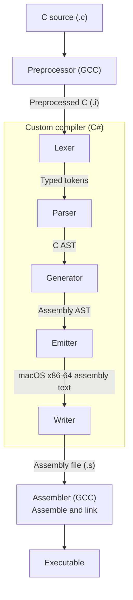

# Compiler architecture

The implementation follows the book's progression from parsing C source through semantic analysis and code generation, with the goal of making each compiler stage clear, testable, and easy to extend.

## Current scope

The custom compiler completes chapter one: a single `int` function with
`void` parameters and one statement returning an integer constant, such as:

```c
int main(void)
{
    return 2;
}
```

The custom compiler rejects syntax outside this grammar, missing tokens, and
trailing tokens. Later chapters' language features are not implemented yet.

## Pipeline

The default custom compiler pipeline is:



Each stage has one job:

1. `Preprocessor` uses GCC to preprocess the C source.
2. `Lexer` returns the typed tokens defined in `Tokens.cs`.
3. `Parser` returns the C AST defined in `C.cs`.
4. `Generator` lowers the C AST to the assembly AST in `Assembly.cs`.
5. `Emitter` returns macOS x86-64 assembly text.
6. `Writer` saves the assembly to a `.s` file.
7. `Assembler` uses GCC to assemble and link the executable.

## GCC-backed mode

The `-gcc` option selects the temporary GCC-backed compiler. GCC handles
preprocessing, assembly generation, assembly, and linking to produce an
executable beside the input file.

See the [README usage instructions](../README.md#usage) for compiler options
and examples.
